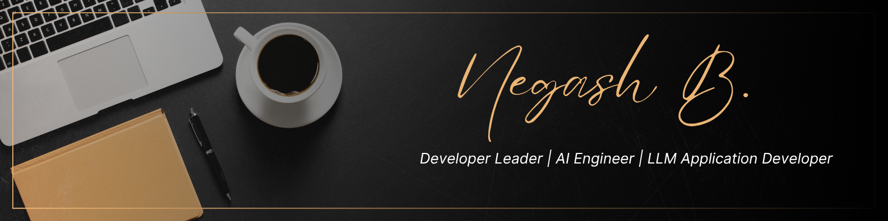

## Hi there  

I am a Developer Leader, AI Engineer, and LLM Application Developer with over 12 years of experience architecting, building, and scaling full-stack applications, enterprise platforms, and zero-to-one products across startup, growth-stage, and highly regulated environments.

As a versatile technology leader and hands-on builder, I thrive in complex, fast-moving environments that require strong ownership, rapid execution, and sound technical judgment. I have extensive experience designing distributed systems, defining scalable architectures, optimizing application performance, and leading engineering teams through all stages of the software development lifecycle.

My expertise spans cloud-native platforms, microservices, AI-powered applications, and enterprise systems, with a strong focus on scalability, reliability, observability, security, and operational excellence. I am comfortable navigating ambiguity, balancing technical debt with business priorities, and making architectural decisions that support long-term growth while maintaining delivery velocity.

My current focus is on applied AI, including large language model (LLM) applications, autonomous agent systems, retrieval-augmented generation (RAG) architectures, and AI-powered product development. I specialize in designing secure, high-performance AI systems that can operate at scale, from experimentation and prototyping through production deployment and continuous optimization.

I am passionate about transforming ambitious ideas into resilient, production-ready solutions that deliver measurable business impact while meeting the highest standards for performance, security, and user experience.
